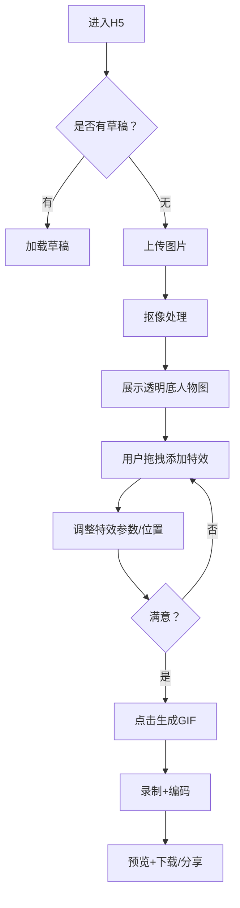

# 微博情报模块重构 — 实现计划

## 核心理念

**参考 WeiboPosts 页面模式**：左侧帖子列表（带 intel_status 筛选），右侧选中帖子后触发 AI 提取并展示结果，管理确认后保存情报并标记帖子状态。

整个流程始终围绕**帖子**展开：
```
帖子列表 → 选择帖子 → AI提取 → 确认/编辑 → 保存情报 → 帖子标记完成
```

---

## 页面结构（微博情报模块）

### 微博情报侧边栏菜单

```
微博情报
├── 情报提取       → WeiboIntelList（主入口，左右布局帖子提取页）
├── 情报管理       → IntelManagement（Tab页：已提取情报 / 审核队列 / 告警中心）
├── AI 批次管理    → BatchControl
└── 关键词库       → KeywordLibrary
```

### 1. 情报提取（WeiboIntelList）— 主入口

- **左侧（55%）**：微博帖子列表
  - 顶部卡片：按情报状态分类统计（全部/未处理/已提取/提取中/不相关/失败），点击切换筛选
  - 帖子列表：状态标签 / 发布时间 / 内容摘要 / 互动数据 / 查看按钮
  - 分页

- **右侧（45%）**：帖子详情 + AI 提取
  - 选中帖子后：完整文本内容 + 互动统计
  - 「触发 AI 提取」按钮 → 调用后端单帖提取 API
  - 提取结果展示 + 可编辑表单
  - 「确认保存」→ 创建情报 + 标记帖子 intel_status=1
  - 「重新提取」/「标记不相关」

### 2. 情报管理（IntelManagement）

三个 Tab：

- **已提取情报** — 所有已创建的情报列表（可筛选已批准）
- **审核队列** — pending 状态的快速审核，支持批量批准/拒绝
- **告警中心** — 仅有告警的情报，支持快速处理

### 3. AI 批次管理（BatchControl）— 保持不变

### 4. 关键词库（KeywordLibrary）— 保持不变

### 5. 情报详情/编辑 — 保持不变

详情页、编辑页保持原有功能。

---

## 后端改动

### 新增 API

| 端点 | 方法 | 作用 |
|---|---|---|
| `/weibo-intel/posts` | GET | 帖子列表（支持 intel_status 筛选、分页、搜索） |
| `/weibo-intel/posts/count` | GET | 按情报状态统计帖子数量 |
| `/weibo-intel/extract-single` | POST | 对单个帖子触发 AI 提取，返回提取结果（不创建情报） |
| `/weibo-intel/create-from-extract` | POST | 确认提取结果，创建情报记录，标记帖子 |
| `/weibo-intel/mark-not-related` | POST | 标记帖子为不相关 |
| `/weibo-intel/extract-result/{mid}` | GET | 获取帖子的最新提取结果缓存 |

### 新增 Model

```python
class SingleExtractResult(BaseModel):
    """单帖提取结果（不持久化，前端展示用）"""
    mid: str
    is_valid: bool
    reason: Optional[str]
    category/title/date/location/price/participants/ips/tags/confidence/...

class CreateFromExtract(BaseModel):
    """从提取结果创建情报"""
    mid: str
    category: IntelCategory
    title: str
    event_start_date/...（各字段可选）
    confidence: float
```

---

## 前端改动

### 新增文件

- `pages/weiboIntel/IntelManagement.tsx` — 情报管理（Tab页）
- `pages/weiboIntel/WeiboIntelList.tsx` — **重写**为左右布局帖子提取主入口

### 删除文件

- `pages/weiboIntel/ReviewQueue.tsx` — 合并到 IntelManagement
- `pages/weiboIntel/AlertCenter.tsx` — 合并到 IntelManagement

### 修改文件

- `api/weiboIntel.ts` — 新增帖子列表、单帖提取相关 API
- `types/weibo.ts` — WeiboPost 添加 intel_status 等字段
- `types/weiboIntel.ts` — 添加 SingleExtractResult 类型
- `router/index.tsx` — 更新路由
- `App.tsx` — 更新侧边栏菜单

---

## 数据流

```
1. 打开页面 → 加载帖子列表（全部帖子，按时间倒序）

2. 点击帖子 → 右侧展示帖子内容

3. 点击「触发 AI 提取」→ POST /extract-single
   → 后端调用 AI
   → 返回 SingleExtractResult
   → 右侧展示提取结果（可编辑）

4. 点击「确认保存」→ POST /create-from-extract
   → 后端：创建 WeiboIntel（status=pending） + 标记帖子 intel_status=1
   → 刷新帖子列表（该帖状态变为"已提取"）

5. 点击「标记不相关」→ POST /mark-not-related
   → 后端：标记帖子 intel_status=3
   → 刷新帖子列表
```

---

## 去重策略

`generate_dedup_hash(title, city, year)` — 标题归一化 + 城市 + 年份生成 MD5 前16位

- 精确匹配：dedup_hash 完全一致 → 合并到已有情报
- 模糊匹配：相似度 > 0.85 → 合并
- 部分匹配：相似度 > 0.6 + 城市一致 + 日期重叠 → 合并
- 无匹配 → 创建新情报

---

## 实现顺序（已完成）

1. 后端新增 API（模型 + Service + 路由）
2. 前端 API 层补充
3. 前端类型补充
4. 重写 WeiboIntelList（左右布局）
5. 新增 IntelManagement（Tab合并）
6. 更新路由和侧边栏

---

## H5 未来功能规划

### 虚拟吧唧（待开发）

**功能描述**：在 H5 端实现虚拟吧唧（Badge/徽章）功能，用户可以在平台上"收集"或"佩戴"虚拟的吧唧徽章，增加互动性和趣味性。

**可能的方向**：
- 用户可购买/获得虚拟吧唧
- 可在个人主页展示已获得吧唧
- 与二次元活动/IP 联动的限定吧唧
- 吧唧收藏册功能

**优先级**：低（未来考虑）


好的，我已经将我们讨论的全部内容，整理成一份面向开发人员的产品需求与技术实现文档。这份文档可以作为后续开发工作的参考。

---

# 📄 产品需求与技术实现文档 —— 二次元谷子特效GIF生成器 (H5)

## 1. 产品概述

### 1.1 定位
一款运行在移动端（微信、支付宝、抖音内）的H5工具，面向二次元/谷子（动漫周边）爱好者。允许用户**上传自己拍摄的谷子/人物照片**（背景可复杂），通过**拖拽式添加特效**（流沙、镭射、光晕边框等），最终生成**带动态特效的GIF图片**，用于社交分享（晒单、痛包展示、谷子名片等）。

### 1.2 核心价值
- **DIY成就感**：自由组合特效，创造独一无二的动态谷子展示图。
- **圈层认同**：特效风格专门针对二次元审美（光污染、流沙麻将、镭射光刃）。
- **轻量易用**：纯H5，无需下载App，在常用App内即开即用。
- **隐私友好**：前期采用前端抠像，图片不上传服务器。

---

## 2. 功能需求

### 2.1 用户上传图片
- **支持格式**：JPG、PNG、HEIC（需前端转码）
- **来源**：相册选取 / 拍照（调用手机摄像头）
- **大小限制**：建议 ≤ 10MB，超过则前端压缩
- **预处理**：自动旋转修正（根据EXIF信息）

### 2.2 抠像功能（去背景）
- **目标**：将上传图片中的人物/主体与背景分离，得到透明背景的PNG。
- **实现方案（分阶段）**：
  - **V1.0 (MVP)**：采用前端纯本地抠像库，如 `@imgly/background-removal`。优点：隐私保护、免费、无需后端。需注意模型加载速度（约20-30MB）和低端机性能。
  - **V2.0 (优化)**：引入后端Python抠像服务（如`rembg`或百度API），为付费用户提供高精度抠图，或作为后台增强静默替换。
- **交互要求**：
  - 抠图过程显示loading动画。
  - 抠图完成后，提供“原图/抠图效果”切换预览。
  - 允许用户手动修补边缘（可选，可通过画笔擦除/恢复）。
- **失败处理**：若抠像效果不佳（例如主体缺失），提示用户可原图继续或重新上传更清晰图片。

### 2.3 特效拖拽添加
- **特效组件库包含**（初期）：
  - **全局光晕边框**：多种颜色（虹彩、赛博蓝、粉紫），可调强度/呼吸频率。
  - **背景流沙粒子**：仿谷子“流沙麻将”效果，粒子可为星沙、亮片、魔法符文。可调节粒子密度、速度、颜色。
  - **前景镭射特效**：动态扫光、旋转射线，可拖拽到画面任意位置（如角色手中、眼睛）。
- **交互方式**：
  - 特效库以卡片形式展示在画布下方（可横向滑动）。
  - **长按/触摸特效卡片 → 拖拽到画布上指定位置松开**，即添加该特效。
  - 拖拽时显示半透明特效缩略，松手后播放该特效的3秒演示动画，用户可调整位置/缩放/旋转（通过手势）。
  - 每个特效可独立选中、删除、复制、调整图层顺序（上移/下移）。
- **状态保存**：支持撤销/重做操作。

### 2.4 GIF生成与导出
- **录制参数**：
  - 默认时长：2秒（可调 1~5秒）
  - 帧率：15 fps（可调 10~20 fps，平衡文件大小与流畅度）
  - 分辨率：以画布实际尺寸为准（建议宽度≤ 500px，高度自适应）
  - 循环次数：无限循环
- **编码库**：使用 `gif.js` (web worker 版本) 在前端编码。
- **导出流程**：
  1. 用户点击“生成GIF”。
  2. 开始录制动画（按设定帧率捕获Canvas帧）。
  3. 编码过程显示进度条。
  4. 编码完成后，自动下载 `.gif` 文件，并提供预览和分享按钮（唤起微信/抖音分享）。
- **备选方案**：在抖音内，可同时生成MP4视频（用`MediaRecorder`）以获得更高画质和兼容性。

### 2.5 辅助功能
- **重置画布**：清除所有特效，恢复原始抠图后的人物图。
- **保存草稿**：将当前特效组合与图片保存至本地LocalStorage，下次进入可继续编辑。
- **一键套用模板**：提供若干预设特效组合（如“赛博镭射”、“梦幻流沙”），点击后自动应用。
- **社交分享**：生成图片后，引导用户保存到相册，并复制预设话题文案（如`#谷子特效 #痛包展示`）分享到抖音/小红书。

---

## 3. 用户操作流程



---

## 4. 技术实现建议

### 4.1 前端技术栈
| 模块 | 推荐库/方案 | 说明 |
|------|------------|------|
| 框架 | Vue 3 或 React 18 | 组件化开发，便于维护 |
| UI库 | Vant / NutUI | 移动端适配组件库 |
| Canvas操作 | 原生Canvas API | 高性能绘制 |
| 抠像 | `@imgly/background-removal` | 前端本地模型，隐私优先 |
| 拖拽交互 | 自定义touch事件 + transform | 模拟drag and drop，需处理页面滚动 |
| 特效动画 | requestAnimationFrame | 流沙粒子系统、镭射光线运动 |
| GIF编码 | `gif.js` (gif.js.worker.js) | Web Worker异步编码 |
| 图片压缩 | `browser-image-compression` | 前端压缩大图 |
| 存储 | LocalStorage | 保存草稿和用户设置 |

### 4.2 后端（可选，V2.0）
- **抠图服务**：Python + `rembg` + FastAPI，部署在云函数（如阿里云FC）或轻量服务器。
- **图片存储**：OSS（可选，用于缓存用户临时图片）
- **API设计**：
  - `POST /remove-bg`: 接收图片base64或form-data，返回透明背景PNG。
  - 鉴权：简单token或IP限流防止滥用。

### 4.3 性能与兼容性
- **Canvas尺寸适配**：根据设备DPR设置canvas宽高，避免模糊。
- **粒子数量控制**：流沙粒子 ≤ 300个，低端机型自动降级至150个。
- **内存管理**：GIF编码时将帧dataURL及时释放，避免OOM。
- **iOS 微信内**：需额外处理`<canvas>`转Blob保存到相册（使用`canvas.toBlob` + 引导长按）。
- **安卓 抖音内**：部分WebView可能限制自动下载，改用`<a>`标签模拟点击下载。

### 4.4 特效实现要点
- **流沙粒子**：
  - 每个粒子对象：x, y, vx, vy, size, color, opacity。
  - 每帧更新位置，超出边界回绕/反弹。
  - 可用`requestAnimationFrame` + `ctx.filter = "blur(1px)"`产生光晕感。
- **镭射光线**：
  - 旋转射线：根据时间角度循环绘制`lineTo`，设置`globalCompositeOperation='lighter'`。
  - 扫光效果：绘制半透明渐变矩形覆盖全屏，移动其位置。
- **全局边框**：
  - 动态阴影：`ctx.shadowBlur`随`sin(time)`变化。

---

## 5. 交互与UI设计要点

- **主界面**：上方为Canvas预览区（占比50%~60%），下方为特效卡片区（可水平滚动），底部操作按钮（生成GIF、重置）。
- **拖拽提示**：首次进入显示引导气泡“长按特效拖到画布上试试~”。
- **加载状态**：抠像、生成GIF时显示全屏半透明loading，带百分比进度。
- **错误提示**：使用轻提示（Toast），避免阻断操作。

---

## 6. 交付产物（供开发）

1. **原型设计图**（Figma / 墨刀）包含主要页面与交互流程。
2. **前端代码仓库**：初始框架（Vue/React + 移动端适配+Canvas基础绘制）。
3. **抠像库集成Demo**：演示上传图片并拿到透明背景。
4. **特效拖拽Demo**：演示从卡片拖拽到画布生成临时特效。
5. **GIF编码Demo**：演示录制Canvas并导出GIF文件。

---

## 7. 后续迭代方向

- **特效商店**：支持下载第三方制作的流沙/镭射特效包。
- **用户社区**：展示优秀作品，提供点赞和套用模板。
- **AI辅助**：自动识别角色头部/手部，智能建议特效附着点（例如光剑自动吸附到手部）。
- **多图合成**：支持上传背景图 + 人物图，合成更复杂的场景。

---

以上内容已涵盖所有关键讨论点，开发人员可据此进行技术选型与功能实现。有任何疑问可随时沟通。